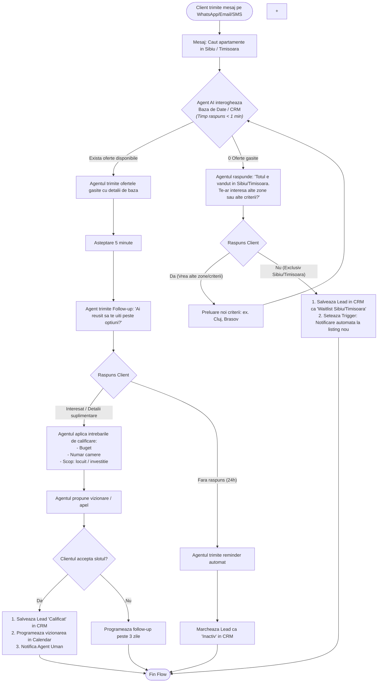
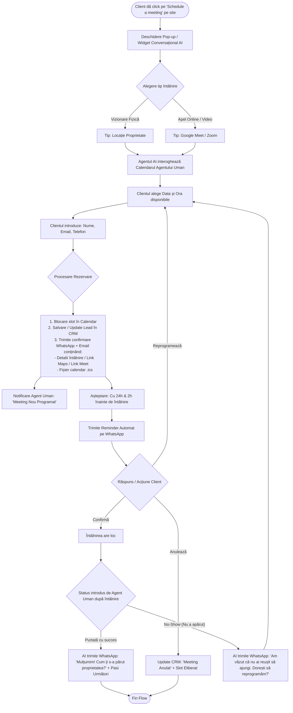
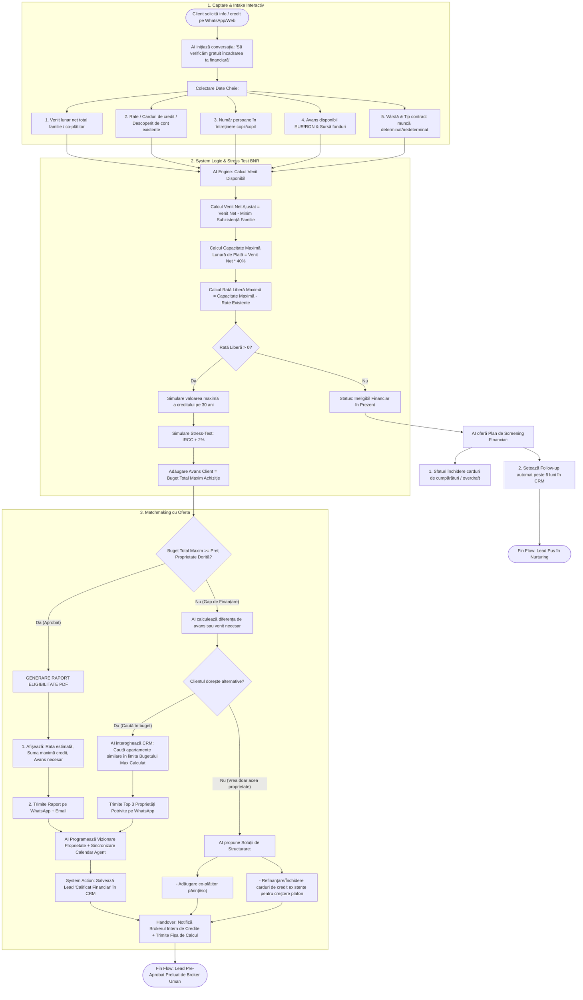

## Agent 24/7 Lead Capture & Qualification
### User flow prezentare oferte in functie de criterii client
Eu ca si client nou caruia nu ii este facil sa se uite manual prin oferta de apartamente pe care le are compania in Sibiu sau Timisoara si nu vrea sa investeasca timp in asta, dau un mesaj pe WhatsApp/Email/nr de telefon in care spun:
`Salut. M-ar interesa niste apartamente rezidentiale in Sibiu si Timisoara. Aveti cumva ceva de genul in oferta voastra?`.
Agentul ar trebui sa urmeze urmatorul flow (atat in engleza cat si in romana):

### User flow preluare si programare client pentru meeting
Eu ca si client care am gasit o oferta printre cele prezentate pe site-ul web, dau click pe butonul `Schedule a meeting`. 

### User flow validare client pentru meeting dpdv financiar
Eu ca si client care am gasit o oferta printre cele prezentate pe site-ul web dar e posibil sa nu am finantarea necesara, asa ca doresc o discutie cu un agent pentru a verifica daca ma incadrez pentru un credit ipotecar.

Acest flow poate fi integrat si in [User flow prezentare oferte in functie de criterii client](#user-flow-prezentare-oferte-in-functie-de-criterii-client)

Astfel de flowuri se pot integra si automatiza in n8n, platforma care e open source si se poate face hosting in cloud cu costuri scazute. 

Alte zone cu un potencial mare de automatizare, este zona de post-tranzactionala, unde se pot automatiza task-uri repetitive cum ar fi: 
1. Trimiterea de mesaje catre client/agenti in diferite etape ale procesului de achizitie
2. Generarea de rapoarte si documente necesare in procesul de a chizitie
3. Preluare de date pentru aplicarea unui credit ipotecar
4. Follow-up cu clientii post achizitie

